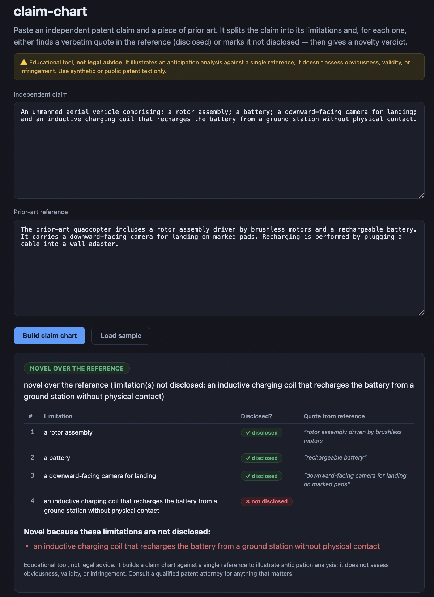
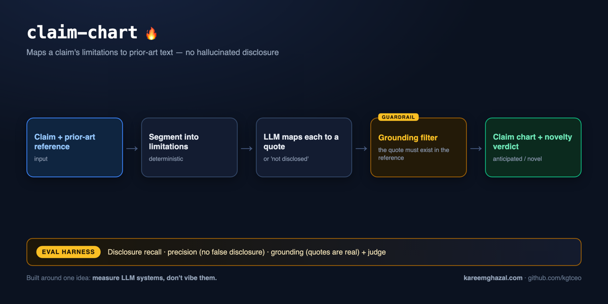

# claim-chart

### ▶ Live demo: **[claim-chart.kareemghazal.com](https://claim-chart.kareemghazal.com)**

[](https://github.com/kgtceo/claim-chart/actions/workflows/ci.yml)

Paste an independent patent **claim** and a piece of **prior art** (or "Load sample") and get a
**claim chart**: each claim limitation mapped to a verbatim quote in the reference (disclosed) or
marked **not disclosed**, plus a novelty verdict. (First run ~10–20s.)

> **Educational tool — not legal advice.** It illustrates an anticipation analysis against a single
> reference; it does not assess obviousness, validity, or infringement, and it is not a substitute
> for a professional prior-art search. Use synthetic or public patent text only. Consult a
> qualified patent attorney for anything that matters.





## What it does

Anticipation (novelty) is strict: a single prior-art reference "anticipates" a claim only if it
discloses **every** limitation of that claim. `claim-chart` automates the bookkeeping:

1. It splits the independent claim into its **limitations** (elements / steps).
2. For each limitation, the model decides whether the reference **discloses** it and, if so, must
   back it with a **verbatim quote** from the reference.
3. A deterministic **grounding pass** drops any "disclosed" mapping whose quote isn't actually a
   substring of the reference (whitespace-normalised, case-insensitive) — so it **can't invent a
   disclosure**. This is the killer safety feature: the model never gets to hallucinate the fact.
4. Verdict: **anticipated** if every limitation is disclosed, else **novel over the reference**
   (with the specific limitations that aren't disclosed).

Built around one idea — *measure, don't vibe*: it's gated by a **planted-case eval set** where each
reference discloses a known subset of limitations, so recall, precision (no false disclosure) and
grounding are all measured, not asserted.

## Quickstart

```bash
pip install -e .
cp .env.example .env   # add ANTHROPIC_API_KEY

claim-chart demo                          # a baked-in synthetic claim + reference pair
claim-chart demo --case novel-drone-charging
claim-chart chart --claim "A method comprising: A; and B." --reference "The prior art teaches A."
claim-chart chart --claim-file claim.txt --reference-file ref.txt
```

## Evals

```bash
python evals/run_evals.py             # deterministic gates: recall / precision / grounding / verdict
python evals/run_evals.py --judge     # also run the opus faithfulness judge
```

- **Recall** — of the limitations the reference truly discloses, a solid share are marked disclosed.
- **Precision** — no limitation that *isn't* disclosed is marked disclosed (**no false disclosure**).
- **Grounding** — every "disclosed" quote appears verbatim in the reference.
- **Verdict** — "anticipated" iff every limitation is disclosed.
- **Judge** — opus scores chart faithfulness (over-reading), completeness, and verdict soundness.

**Latest run (claude-sonnet-4-6, opus judge):** all gates pass — on the **3 planted claim + prior-art
cases** (one anticipated, two novel-over-the-reference, each with a known set of disclosed vs
not-disclosed limitations), disclosure recall **1.00** and precision **1.00** (no false disclosure),
every "disclosed" quote is verbatim-grounded in the reference, and all 3 novelty verdicts are correct.
It's a small, hand-labelled set — enough to gate the grounding + verdict logic, not a benchmark;
add your own — each case is one JSON object in `evals/dataset/cases.json`:

```json
{ "name": "my-case",
  "claim": "A device comprising A, B and C.",
  "reference": "...prior-art text...",
  "planted_disclosed": [1, 2],
  "expected_verdict": "novel over the reference" }
```

`planted_disclosed` lists which limitations the reference actually discloses (by index — mirror an
existing case); `expected_verdict` is `"anticipated"` or `"novel over the reference"`.

## Limitations (what it does NOT do)

- **Single-reference anticipation only** — it charts a claim against *one* reference (a §102-style
  anticipation view). It does **not** assess obviousness (§103) over a combination of references,
  enablement, or overall patentability.
- **The LLM segments and maps** the limitations; the deterministic part is the grounding filter
  (a "disclosed" quote must appear verbatim in the reference) and the verdict. Unusual claim phrasing
  can be segmented imperfectly — treat the chart as a **first-pass draft for a human to confirm**.
- Best on **synthetic or public** patent text; it is not a substitute for a professional prior-art
  search or an attorney's invalidity/FTO analysis.

## Tests

```bash
pytest -q   # offline: segmentation, the grounding pass drops fabricated quotes, verdict logic
            # (fake client, no API key, no network)
```

## Web

`web/` — a Next.js UI: two textareas (claim + reference), a limitation-by-limitation chart table
(disclosed / not disclosed + the grounded quote), the novelty verdict, and the not-legal-advice
banner throughout.

Run it locally in two terminals:

```bash
# terminal 1 — the API
pip install -e .
cp .env.example .env                  # add ANTHROPIC_API_KEY
python -m uvicorn claim_chart.api:app --port 8000

# terminal 2 — the UI
cd web
npm install
echo "NEXT_PUBLIC_API_URL=http://localhost:8000" > .env.local
npm run dev                           # open http://localhost:3000
```

See [DEPLOY.md](./DEPLOY.md).

## License

MIT — see [LICENSE](./LICENSE).
